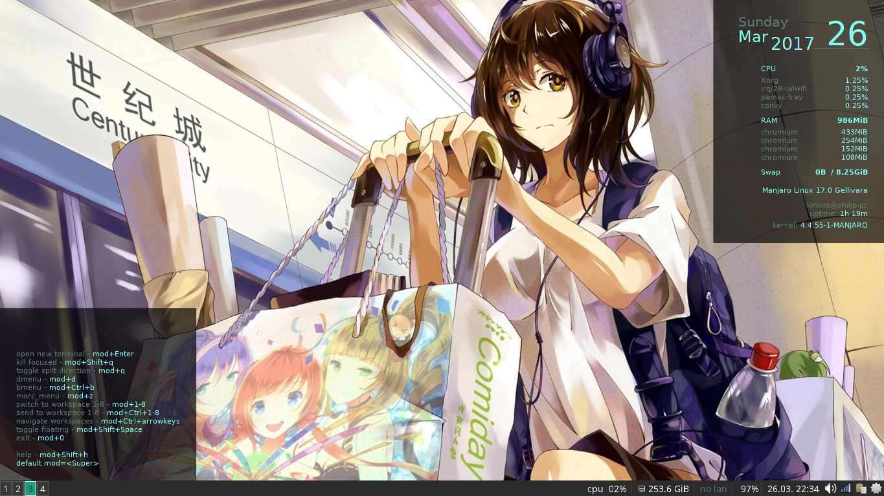

# Rice BG

Rice BG generates a json object with linux system info and passes that info
into a javascript file. We then use html/javascript to dynamically create
a background image using phantomjs. After the jpg is created we use feh to
set system background. 

Currently working on having this add half transparent black boxes to any background image for use with Manjaro i3-wm:

## Requirments

* feh
* npm

## Instructions

After you download and cd into the directory and run `./install.sh`:

You can set an image as your background with `./makeHome.sh yourImage.jpg`

Add the -b flag if you want to add the black boxes as shown below `./makeHome.sh -b yourImage.jpg`
